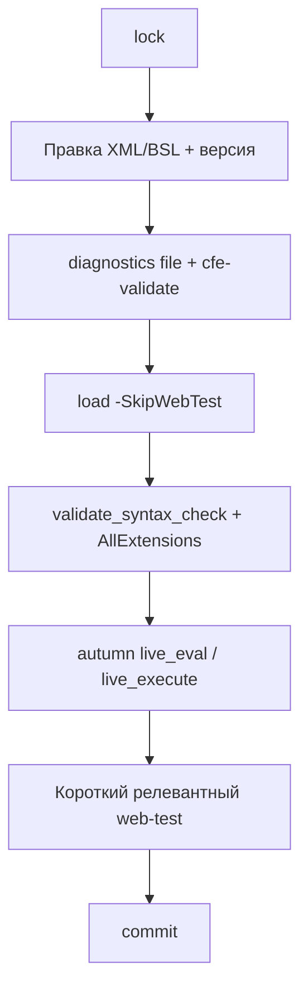

# Хранилище расширений 1С

Только расширения из `repository.json`. Основную конфигурацию не трогать.

## Движок: `repo.ps1` (канон)

Скрипт: `%USERPROFILE%\.cursor\skills\repo-workflow\scripts\repo.ps1`  
(движок: глобальный **vrunner 3**, `run designer`; IB — `autumn-properties.json` проекта).

```powershell
powershell.exe -NoProfile -File "$env:USERPROFILE\.cursor\skills\repo-workflow\scripts\repo.ps1" `
  -Action lock|load|commit|unlock|update|add-user <параметры>
```

**MCP `repo_*` (vrunner) — не основной путь** для CFE из `repository.json`. Канон — этот скрипт. Не мигрировать операции на MCP. Не вызывать Конфигуратор вручную (`1cv8`).

Хранилище работает с конфигурацией **в информационной базе**, не с XML на диске. Помещение без загрузки в ИБ оставляет в Конфигураторе и в хранилище старую версию.

## Карта `repository.json`

```json
{
  "root": "Z:\\Хранилища",
  "user": "ИмяПользователяХранилища",
  "adminUser": "Администратор",
  "cfe": {
    "ИмяРасширения": "ПапкаХранилищаОтносительноRoot"
  }
}
```

- Путь и пользователь — только из этого файла. Не угадывать каталог.
- Нет имени в `cfe` — хранилища нет, операция не выполняется, сообщить и остановиться.
- `repository.json` — только в корне проекта, не в профиле Cursor.

## Порядок полного цикла (обязательный)

Агент **сам** гоняет гейты ниже — пользователь не обязан каждый раз просить «diagnostics / syntax / live до web».

### Куда что льётся (карта потоков — читать перед циклом)

В цикле четыре разных приёмника, их нельзя путать:

| Шаг | Откуда → куда | Операция | Что это значит |
|-----|---------------|----------|----------------|
| `load` (ч.1) | файлы `src/cfe` → **Конфигуратор ИБ** | `LoadConfigFromFiles` с ключами хранилища | Черновик попадает в конфигурацию ИБ, хранилище **не тронуто** |
| `load` (ч.2) | Конфигуратор ИБ → **БД** | `infobase update --dynamic` | Новая конфигурация применяется к данным — **здесь код впервые исполняется** |
| гейты 6 | проверка **на живой dev-БД** | syntax-check / live / web-test | Доводка до работы идёт на базе, а не в файлах |
| `commit` | Конфигуратор ИБ → **хранилище** | помещение из ИБ | В хранилище уезжает только то, что уже проверено на dev-БД |

Порядок диктует платформа, а не вкус: `commit` в 1С всегда идёт **из ИБ**, а не из файлов, поэтому «сначала commit, потом проверка на базе» технически невозможна — в хранилище уедет старая конфигурация из Конфигуратора. Обратное («править сразу в Конфигураторе мимо файлов») запрещено: файлы — единственный ревьюируемый и версионируемый источник.

1. **Захват** (`-Action lock`). Для новой метаданки или смены состава — всё расширение (`-WholeExtension`).
2. **Правка XML/BSL** в `src/cfe` через профильные скиллы (`meta-*`, `subsystem-*`, `form-*`, `cfe-patch-method`, …). Версию поднять по `1c-versioning`.
3. **Гейты до load** (после правки BSL/структуры):
   - **bsl-analyzer** `diagnostics` `file` по каждому затронутому `.bsl` (`min_severity=warning`). Ложные срабатывания на `&НаСервере`+`&После` / сигнатуру перехвата — не блокер, если паттерн уже принят в модуле.
   - **cfe-validate** по каталогу расширения (скилл `cfe-validate`). Ошибки — стоп; warning вроде пустого DefaultLanguage — ок.
4. **Загрузка файлов в Конфигуратор ИБ** (`-Action load` **с `-SkipWebTest`**; в хранилище на этом шаге **ничего** не пишется). Не `compileext`, не MCP `extensions_loadFromSrc` / `cfe_load`.  
   Авто-smoke после update (`scenarios/after-load/*`) часто **не про доработку** (например `opv.js` — только подвал реализации). Поэтому в полном цикле load всегда с `-SkipWebTest`; релевантный web — отдельным гейтом перед commit.
5. **Обновление конфигурации БД расширения** — автоматически внутри `load`: `vrunner infobase update --target <Имя> --dynamic`.
6. **Гейты после load** (до commit):
   - **vrunner** `validate_syntax_check` с режимами из `autumn-properties.json` → `vrunner.validate.syntax-check.mode` **плюс** `AllExtensions` (если ещё нет в списке). Ошибки компиляции — стоп.  
   - **autumn** `live_check_syntax` / `live_eval` / `live_execute` (если live MCP доступен): дымовая проверка нового кода или вызова серверного API. Нет live — сообщить и не подменять «успехом»; для чисто структурных правок без BSL можно пропустить.
   - **web-test** короткий и **по смыслу правки** (открытие затронутой формы / точечный сценарий из `tools/web-test/scenarios/manual/` или inline). Не гонять полный UI-мастер, если доработка — серверный `&После`. Авто-`after-load` можно дополнительно прогнать, только если он реально релевантен расширению/правке.
7. **Помещение** (`-Action commit` с `-Comment`: что изменилось и какая версия) **только после успешных гейтов 3 и 6**.

Нельзя: захват → правка XML → сразу помещение. Без load + гейтов в ИБ/хранилище уйдёт непроверенное.

Перед `load` закрой **Конфигуратор** для этой ИБ — иначе обновление БД упадёт с ошибкой блокировки. Сеанс с **MCP_Toolkit.epf** тоже держит базу — перед load закрой обработку / `close_1c_session`.



### Когда lock объекта vs всего расширения

| Ситуация | Что захватывать |
|----------|-----------------|
| Правка существующего объекта | Объект по `-Path` или `-FullName` |
| Новая метаданка / смена состава ChildObjects | Всё расширение: `-WholeExtension` (или `-Extension` без `-FullName`) |
| Смена версии в `Configuration.xml` | Корень / объекты, которые реально меняешь; при сомнении — `-WholeExtension` |

Освободить без помещения — `-Action unlock`. Подтянуть из хранилища в ИБ (не из XML) — `-Action update`.

---

## Операции `repo.ps1`

Общий префикс команды:

```powershell
powershell.exe -NoProfile -File "$env:USERPROFILE\.cursor\skills\repo-workflow\scripts\repo.ps1"
```

Общие параметры пути (lock / unlock / commit / update):

| Параметр | Описание |
|----------|----------|
| `-Path` | Файл или каталог в `src/cfe`. Имя расширения и объект берутся из пути |
| `-Extension` | `<Name>` расширения, если пути нет |
| `-FullName` | Например `Роль.МР_ОсновнаяРоль`. Без него при `-Extension` захватывается всё расширение |
| `-WholeExtension` | Захват/операция по корню расширения. Нужен для новой метаданки |
| `-Recursive` | По умолчанию `$true` (с дочерними). Только объект: `-Recursive:$false` |

`-force` и `--revised` **не передавать никогда**.

### Lock — захват

Захватывает объект или всё расширение. XML в ИБ **не** загружает. Перед правкой XML — сначала захват.

```powershell
... -Action lock -Path "src/cfe/<Расширение>/Roles/МР_ОсновнаяРоль.xml"
... -Action lock -Extension "МоёРасширение" -WholeExtension
```

### Unlock — освобождение

Снимает захват без помещения. Локальные незапомещённые изменения в ИБ могут помешать — не обходи через `-force`.

```powershell
... -Action unlock -Path "src/cfe/<Расширение>/..."
```

Параметры пути — как у lock.

### Load — загрузка XML → ИБ

Загружает `src/cfe/<Имя>` в ИБ и **обновляет конфигурацию БД расширения**. Нужна **после правки XML и до** гейтов после load / commit. Объекты к этому моменту должны быть захвачены (lock).

Скрипт делает **частичную** загрузку (`-listFile`) захваченных объектов и передаёт ключи хранилища вместе с `-Extension`.

```powershell
... -Action load -Extension "<Имя>" -SkipWebTest
```

| Параметр | Описание |
|----------|----------|
| `-Extension` / `-Path` | Имя расширения или путь внутри `src/cfe/<Имя>` |
| `-SkipWebTest` | Не запускать Playwright после update (**норма для полного цикла**) |

Без `-SkipWebTest` скрипт после update может запустить Playwright из `smoke.config.json` — только если явно нужен старый авто-smoke, а не полный цикл проверок.

### Commit — помещение в хранилище

Помещает ранее захваченные объекты **из ИБ**. Комментарий обязателен.

Если менялись XML в `src/cfe`, **сначала** load. Иначе в хранилище уйдёт старая конфигурация из Конфигуратора. До commit — гейты 3 и 6 выше.

```powershell
... -Action commit -Path "src/cfe/<Расширение>/..." -Comment "текст"
```

| Параметр | Описание |
|----------|----------|
| `-Path` / `-Extension` / `-FullName` / `-WholeExtension` | Как у lock |
| `-Comment` | Обязателен (что изменилось и какая версия) |
| `-Recursive` | По умолчанию `$true` |
| `-KeepLocked` | Оставить захват после помещения. Только если пользователь явно просил |

### Update — получение из хранилища

Обновляет объекты расширения **в ИБ из хранилища**. Конфигурацию БД и XML-выгрузку сам не трогает. Это **не** загрузка из `src/cfe` (для неё — load).

```powershell
... -Action update -Path "src/cfe/<Расширение>/..."
```

| Параметр | Описание |
|----------|----------|
| `-Path` / `-Extension` / `-FullName` / `-WholeExtension` | Как у lock |
| `-Version` | Номер версии хранилища. Пусто — актуальная |
| `-Recursive` | По умолчанию `$true` |

После получения не выгружай XML и не обновляй БД, пока пользователь не попросил.

### Add-user — пользователь хранилища

Создаёт пользователя в хранилище расширения. Подключается как `adminUser` из `repository.json` (по умолчанию `Администратор`).

```powershell
... -Action add-user -Extension "<Имя>" -NewUser "<логин>" -Role LockObjects
```

| Параметр | Описание |
|----------|----------|
| `-Extension` | `<Name>` расширения из карты |
| `-NewUser` | Создаваемый логин |
| `-Role` | `ReadOnly`, `LockObjects` (по умолчанию), `ManageConfigurationVersions`, `Administration` |

`Administration` — только если пользователь явно попросил. Пароль не передаётся.

---

## web-test

Конфиг проекта: `tools/web-test/smoke.config.json` — `webUrl`, сценарии по расширению в `extensions`, `defaultScript`.

| Когда | Что |
|-------|-----|
| Полный цикл до commit | Свой короткий сценарий по затронутой форме/документу (см. гейт 6) |
| Авто после `load` без `-SkipWebTest` | `scenarios/after-load/*` — только если явно нужен регресс «как раньше» |
| ecoladev OPV after-load | `opv.js` — подвал реализации/корректировки, **не** ГТД/возврат |

Сценарии: `tools/web-test/scenarios/after-load/` и `manual/`. Закрытие форм — `closeForm({ save: false })`. Skill: `web-test`.

## Правки XML расширения

- Собственный объект: префикс из `<NamePrefix>` в `Configuration.xml` и `<ObjectBelonging>Native</ObjectBelonging>`.
- Корень расширения остаётся `Adopted`. Не грузить XML расширения в основную конфигурацию.
- После `load` может обновиться `ConfigDumpInfo.xml` — это ожидаемо.

## Почему не обычная загрузка

| Что | Почему нельзя |
|-----|----------------|
| `compileext` / `extensions_loadFromSrc` / `cfe_load` без ключей хранилища | «Загрузка невозможна: текущая конфигурация помещена в хранилище» |
| Полная `/LoadConfigFromFiles` (весь каталог) | Платформа запрещает полную загрузку при хранилище. Скрипт делает **частичную** (`-listFile`) по захваченным объектам |
| `vrunner lockrepo` / `commit` без `-Extension` | Бьют в **основную** конфигурацию |
| `--storage-name` у `designer` вместе с загрузкой расширения | Хранилище садится на основную конфигурацию. Для `load` ключи F/N идут в `--additional` рядом с `-Extension` |
| `-Extension` до пути `/LoadConfigFromFiles` | Платформа грузит основную конфигурацию (ошибка принадлежности) |
| `load` на **vrunner 3**: «Ошибка чтения параметров команды» | `--additional` для load не должен начинаться с `-Extension` — CLI vrunner воспримет как свой ключ. Скрипт добавляет префикс `/DisplayAllFunctions` |

## Жёсткие правила

- `-force` не передавать никогда.
- Не вызывать Конфигуратор вручную (`1cv8`): только `repo.ps1` (канон) / MCP vrunner для прочих операций (не замена `repo.ps1` для CFE из `repository.json`).
- Один пользователь хранилища на ИБ — из `repository.json` (не заводить второго на ту же базу).
- **Не** коммитить в хранилище, пока гейты 3 и 6 не зелёные (или явно согласован пропуск live/web с пользователем при недоступности MCP/публикации).

## Сбои

| Симптом | Действие |
|---------|----------|
| Блокировка при update БД | Закрыть Конфигуратор / toolkit-сеанс, повторить `load` |
| Объект не захвачен | `lock`, затем снова `load` |
| Нет имени в `repository.json` → `cfe` | Стоп, сообщить; не угадывать путь хранилища |
| Live / web недоступны | Сообщить; не помечать гейт «успехом»; commit только с явным согласием пользователя на пропуск |
| Ошибка чтения параметров vrunner 3 на load | Не править `repo.ps1` наугад — префикс `/DisplayAllFunctions` уже в скрипте; проверить версию vrunner |
